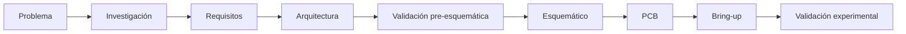

# Assistive Auditory System — proyecto de I+D

> **Estado actual:** investigación aplicada, definición de requisitos y validación previa al diseño de hardware.  
> **No existe todavía un prototipo físico validado.**

## Descripción

Proyecto independiente de I+D sobre un sistema auditivo asistivo orientado a mejorar la conciencia sobre eventos relevantes del entorno.

Esta versión pública no busca documentar la implementación completa. Su objetivo es mostrar el **proceso de ingeniería** utilizado para convertir una idea abierta en requisitos, decisiones verificables y etapas de validación antes de invertir en hardware.

## Estado del proyecto

| Área | Estado |
|---|---|
| Definición del problema | **Completada** |
| Investigación de antecedentes | **Completada** |
| Requisitos y métricas | **Definidos** |
| Arquitectura interna de investigación | **Definida; no validada físicamente** |
| Validación de recursos del MCU | **Ejecutada para la configuración primaria** |
| Validaciones físicas | **Pendientes** |
| Esquemático / PCB final | **No congelados** |
| Prototipo físico integrado | **No existe todavía** |

## Metodología

La regla principal del proyecto es sencilla: **una decisión de diseño no se trata como resultado hasta que exista evidencia suficiente para sostenerla**.

Por eso se usan gates antes de avanzar a etapas más costosas. Si una prueba cambia una decisión importante, la arquitectura se reabre en lugar de forzar el diseño anterior.

## Progreso técnico público

Hasta esta versión:

- se realizó investigación de antecedentes y restricciones;
- se definieron requisitos, métricas y criterios de avance;
- se estructuró una arquitectura de investigación por fases;
- se realizaron comparaciones de alternativas y presupuestos técnicos;
- se reprodujo una configuración primaria en STM32CubeMX/CubeIDE y se verificó su compilación;
- durante la revisión se detectó una discrepancia de generación que fue corregida antes de cerrar esa validación;
- las pruebas físicas de adquisición, integración, consumo y carga concurrente siguen pendientes.

No se publican aquí parámetros, configuraciones completas, algoritmos, esquemáticos ni detalles que permitan reconstruir la implementación.

## Qué falta validar

Entre los puntos todavía abiertos están:

- comportamiento físico de la adquisición;
- estabilidad temporal del sistema real;
- consumo y autonomía medidos;
- interferencias entre subsistemas;
- carga de CPU/RAM bajo operación concurrente;
- desempeño de los algoritmos con datos reales;
- interacción y utilidad con usuarios objetivo.

No hay resultados de efectividad clínica ni se presenta el proyecto como dispositivo médico o sistema de seguridad certificado.

## Herramientas utilizadas

- STM32CubeMX
- STM32CubeIDE / toolchain ARM
- Python para cálculos y presupuestos reproducibles
- documentación técnica y datasheets
- Markdown para trazabilidad y documentación
- herramientas de IA para investigación, contraste de alternativas y revisión

## Mi rol

Es un proyecto independiente. Mi trabajo ha incluido investigación, definición de requisitos, estructuración de arquitectura, comparación de alternativas, planificación de validación, seguimiento de riesgos y documentación técnica.

También he utilizado IA como herramienta de apoyo para acelerar investigación y revisión. Las hipótesis, estimaciones y resultados verificados se mantienen separados para evitar presentar como demostrado algo que todavía no se ha probado.

## Límites de esta versión pública

Este repositorio es deliberadamente limitado. No incluye el diseño completo del sistema, archivos de hardware, configuración reproducible, algoritmos detallados, parámetros experimentales internos ni documentación de propiedad intelectual.

Para el estado y los próximos pasos públicos, ver:

- [Roadmap de desarrollo](docs/development-roadmap.md)
- [Estrategia de validación](docs/validation-strategy.md)
- [Resumen de portafolio](portfolio/project-summary.md)
