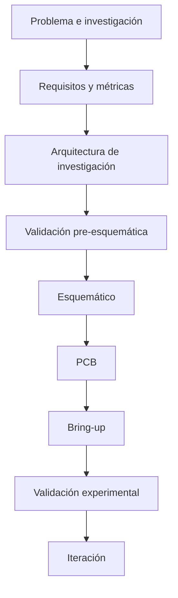

# Roadmap de desarrollo

El proyecto se organiza por etapas para reducir el riesgo de fijar hardware antes de validar las decisiones que lo condicionan.

## Estado público

| Etapa | Estado |
|---|---|
| Problema e investigación | **Completada** |
| Requisitos y métricas | **Completada** |
| Arquitectura de investigación | **Definida** |
| Validación de recursos de software | **Parcialmente cerrada** |
| Validaciones físicas | **Pendientes** |
| Esquemático final | **Bloqueado por validaciones** |
| PCB final | **No iniciada** |
| Prototipo integrado | **No existe todavía** |

## Próximos pasos

1. Cerrar las validaciones previas al esquemático.
2. Ejecutar pruebas físicas de adquisición e integración.
3. Medir consumo y comportamiento concurrente.
4. Revisar las decisiones afectadas por resultados reales.
5. Solo después, congelar el esquemático de la primera revisión de hardware.
6. Fabricar, realizar bring-up y comenzar la validación experimental.

La versión pública evita documentar parámetros y mecanismos internos de esas pruebas.
